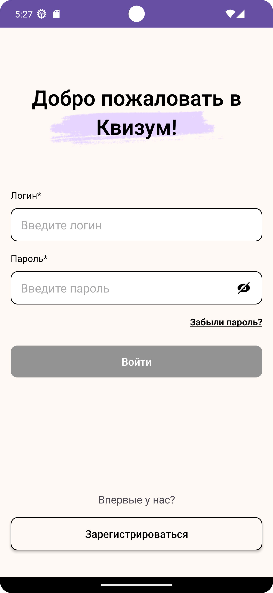
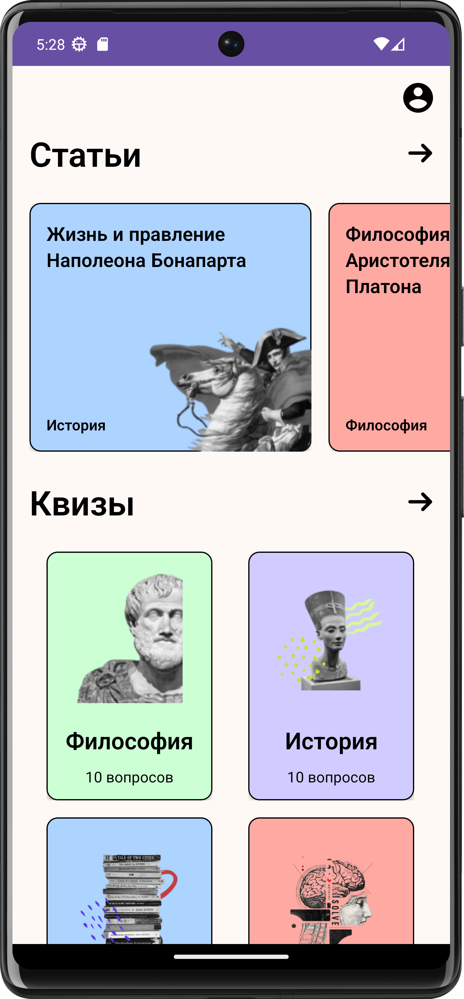
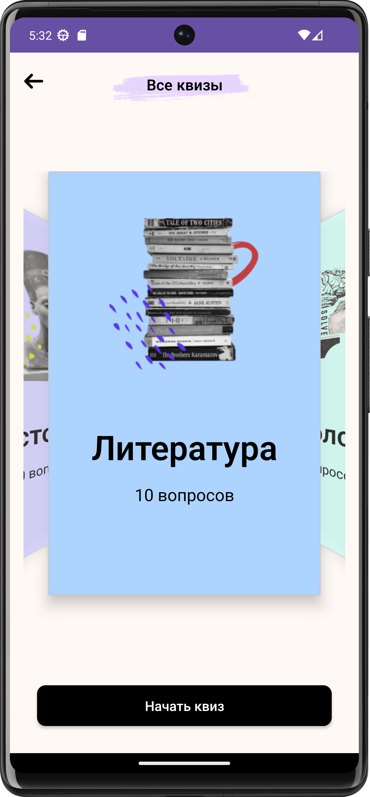
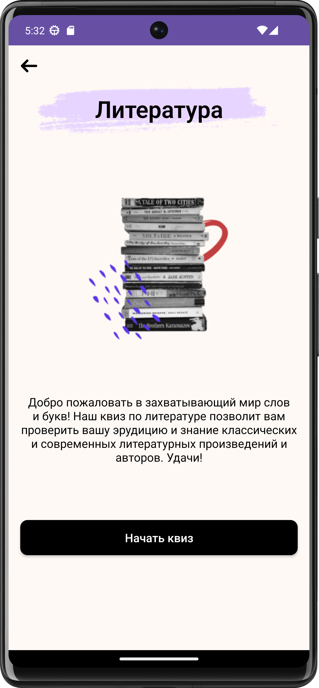
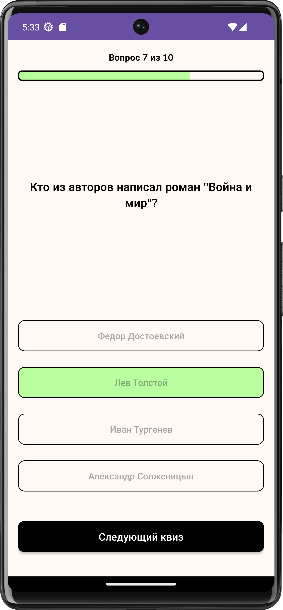
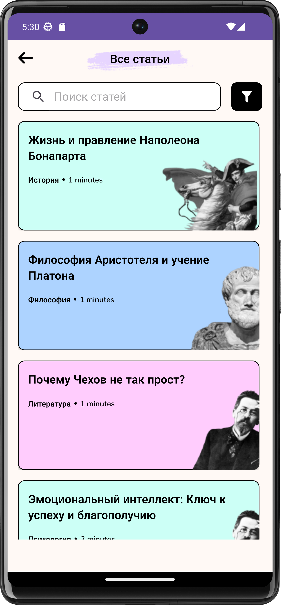
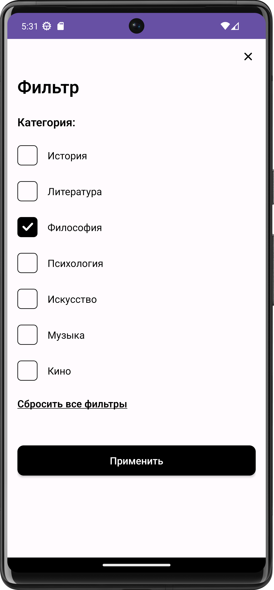
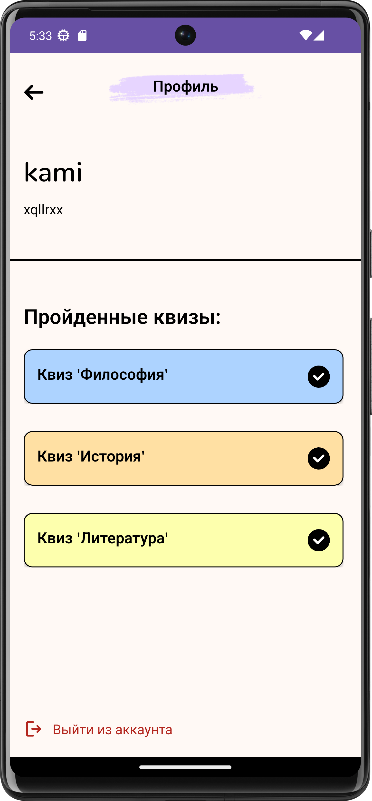

# NeoQuiz

Quizum is an innovative mobile application aimed at making the learning process exciting and effortless. It introduces a fresh approach to education, blending articles and quizzes into a seamless experience. Whether you're a student looking to enhance your knowledge or an educator seeking innovative teaching tools, Quizum is poised to transform the educational landscape.
In our fast-paced, ever-evolving world, traditional methods of curating educational content and conducting tests can be cumbersome. The manual tasks of sorting articles, creating quizzes, and tracking results often pose challenges. Quizum streamlines this process, making education accessible and engaging for all.
Moreover, Quizum is eco-friendly. Digital learning reduces paper consumption and minimizes waste, contributing to a more sustainable future. Each quiz and article you engage with changes the world within and around us for the better.
Join us on this educational journey as we bring Quizum to life. Let's learn, grow, and make a positive impact together.

## Technologies
- Recycler View
- Material Design
- Retrofit
- Glide
- Bundle
- Fragment Result API
- ConstraintLayout
- ScrollView

## Pictures

## License
The MIT License (MIT)
Copyright (c) 2023 Kamila Rybakova
